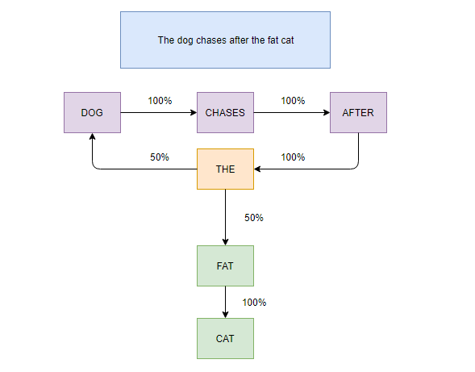
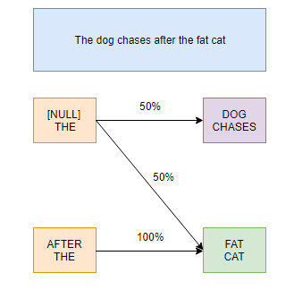

```{r setup, include=FALSE}
knitr::opts_chunk$set(echo = TRUE, warning = F, message = F)
```

# Summary

This project will use machine learning and natural language processing to build a "next word" predictive model such as the ones we have on our smartphones keyboards. For that, we use a database provided by SwiftKey. Our whole research will be made on R.

# Loading packages

This project will use the following packages ; if you want to reproduce this research, make sure to download them :

```{r}
library(dplyr)
library(ggplot2)
library(caret)
library(e1071)
library(quanteda)
library(markovchain)
library(data.table)
library(knitr) # Md document aesthetics
library(kableExtra) # Md document aesthetics
```

# Loading the data

As a personal habit, I automate the download, unzipping and loading process to make the project reproducible. This chapter will create a "data" folder in your current working directory and download SwiftKey's training dataset there.

```{r}
if (!file.exists("data")) {
   dir.create("data")
}
urlfile <- "https://d396qusza40orc.cloudfront.net/dsscapstone/dataset/Coursera-SwiftKey.zip"
filename <- "./data/swiftkey_db.zip"

if (!file.exists(filename)) {
   download.file(urlfile, filename, method = "curl")
}

dataset.name <- "final"
if (!file.exists(dataset.name)) {
   unzip(filename)
}
```

The unzipped folder contains blog, news and twitter text for 4 different languages : english, german, finnish and russian. That's a total of 12 datasets, all collected by a web crawler, and we will only focus on the english ones.

```{r, cache=T}

blogcon <- file("./final/en_US/en_US.blogs.txt", "r") 
blogtext <- readLines(blogcon, encoding = "UTF-8") 

newscon <- file("./final/en_US/en_US.news.txt", "r") 
newstext <- readLines(newscon, encoding = "UTF-8") 

twitcon <- file("./final/en_US/en_US.twitter.txt", "r") 
twittext <- readLines(twitcon, encoding = "UTF-8") 

close(blogcon)
close(newscon)
close(twitcon)

```

# A bit of exploratory data analysis and pre-processing

When dealing with our case of text analytics, pre-processing and exploration will be tightly linked. We will often need to do some processing in order to explore the data. 

Moreover, we want as little bias as possible in our model, so we will split our datasets into a training and testing set as soon as possible and do the exploration only on the training set.

## Structure

Now that the text files are open, we might want to take a look at the content, starting at the datasets' sizes :

```{r, cache=T}
summarydf <- data.frame(
   Object = c("Blog dataset", "News dataset", "Twitter dataset"),
   Nr.of.elements = sapply(list(blogtext, newstext, twittext), length),
   length.longest.element = c(
      max(sapply(blogtext, nchar)),
      max(sapply(newstext, nchar)),
      max(sapply(twittext, nchar))
   ),
   dataset.size = sapply(list(blogtext, newstext, twittext), object.size)
)

kable(summarydf) %>% kable_styling(bootstrap_options = c("striped", "hover"))
```

We have extremely large datasets, taking a total of more than 600MB of memory. While the twitter datasets only has small entries with a maximum of 140 characters, it has more that 2 millions of them. The blog dataset, on the contrary, has large elements, the biggest one having more than 40 thousand characters, while still having close to a million entries.

Considering the sizes of the datasets, we might not want to use 100% of the available data in our model building. This is good, it means that we can be selective in our filtering and pre-processing and still end up with a large enough database to build an efficient model.

We'll start by building a training set that consists of 10% of each dataset.

```{r, cache=T}
set.seed(1234)
blogtrain <- sample(blogtext, 0.1*length(blogtext))


newstrain <- sample(blogtext, 0.1*length(newstext)) 


twittrain <- sample(blogtext, 0.1*length(twittext)) 


training <- c(blogtrain, newstrain, twittrain)

# removing obsolete datasets to save some RAM
rm(blogtext)
rm(twittext)
rm(newstext)
rm(blogtrain)
rm(newstrain)
rm(twittrain)
```

## What's next ?

Now that we have datasets to work on, we'll manipulate them a little. The following steps have one aim : to create a frequency matrix, which displays the frequency with which every word is used. With that, we'll know on what our model can be built on. 

For instance, if we find out that we can cover 90% of texts with only a small subset of words, we can greatly reduce the complexity of our model by having a high accuracy on these words and an average one on the others.

## Tokenization

The first thing we will do with our training set is tokenization : we will split our lines of text into chunks of words. For instance, we want the sentence "This watch is Mike's" to become ["this" "watch" "is" "mike" "s"].

This is where the package quanteda comes in ; it can automate this process with its tokens() function. We will set the following parameters :

- Do not tokenize numbers
- Do not tokenize punctuation
- Do not tokenize symbols such as dollar signs or hashtags
- Do not tokenize URLS
- Do not tokenize twitter words such as "rt"
- Split hyphenated words

```{r, cache=T}
train_tokens <- tokens(training, what = "word", remove_numbers = T,
                       remove_punct = T, remove_symbols = T, split_hyphens = T,
                       remove_url = T, remove_twitter = T)
```


Let's check how that changed one of our lines :

```{r}
training[1]
train_tokens[[1]]
```

Finally, to get the full transformation we wanted, we convert all of the tokens to lower case :

```{r, cache=T}
train_tokens <- tokens_tolower(train_tokens)
```


## Token processing

### Stopwords

In every language, some words are here for grammatical purposes and are not the ones that carry the message of the sentence. These words are called stopwords, and their presence can confuse our predictive model, so we'll filter them out.

An example of a stopword in the english language is "the". Here's a sample of the built-in list of stopwords provided by the quanteda package

```{r}
stopwords(language = "en")[1:10]
```

We'll use that to filter them out in our dataset :

```{r, cache=T}
train_tokens <- tokens_select(train_tokens, stopwords(), selection = "remove")
```

Let's take the first element and see how it has changed now :

```{r}
train_tokens[[1]]
```

### Profanity filtering

We'll get a bit politically correct here, and prevent our model from both taking profanities into account and suggesting them as predictions. Since we use a tweeter database we're bound to encounter some otherwise.

There's a public list of profanities available [here](https://www.frontgatemedia.com/a-list-of-723-bad-words-to-blacklist-and-how-to-use-facebooks-moderation-tool/) for webmasters or moderators to use, and this is what we'll use here to filter them out.

```{r, cache=T}
# Getting the list
profanities <- read.csv(
   "https://www.frontgatemedia.com/new/wp-content/uploads/2014/03/Terms-to-Block.csv", 
                        header = F, sep = ",", skip = 4)
profanities[, 2] <- gsub(pattern = ",", replacement = "", profanities[, 2])
profanities <- profanities[, 2]

# Filtering

train_tokens <- tokens_select(train_tokens, profanities, selection = "remove")
```


## Frequency matrix

We can now create our frequency matrix - or document feature matrix (DFM). Since our dataset has had quite some steps of pre-processing, we do not need a lot of parameters when creating it.

```{r, cache=T}
unigram <- dfm(train_tokens, tolower = F)
```

We can now see the most frequent words in our dataset :

```{r}
unifreq <- textstat_frequency(unigram)
head(unifreq)
top50 <- filter(unifreq, rank <= 50)
qplot(reorder(feature, rank), frequency, data = top50) + 
   labs(x = "Word", y = "Frequency") + ggtitle("Most frequent words (top 50)") +
   theme(axis.text.x = element_text(angle = 90, vjust = 0.5, hjust=1),
         plot.title = element_text(hjust = 0.5))
```


Now that we saw the top 50 words, let's see a more detailed breakdown of the frequencies in our dataset :

```{r}
quantile(unifreq$frequency)
```

75% of the words in our dataset appear 6 times or less. 

We'll create a dataset that shows the count of each words in our training corpus, and we set a benchmark of at least 4 total counts. The words below that will be removed, and this will greatly reduce our training set's size :

```{r, cache=T}
unifreq <- data.table(word = unifreq$feature, count = unifreq$frequency)
unifreq <- unifreq[count > 4, ]
```


# Markov Chains and N-Grams

What we plan on doing here is to build a predictive model using Markov Chains, which will interpret text as a "current state", with a probability of having a next word as the "next state". 

For example, when looking at the sentence "the dog chases after the fat cat", each word has a probability of leading to the next :



The word "the" has a 50% chance of leading to "dog" and 50% chance of leading to "fat", while the other words only have one result with a probability of 100%. 

This is how our model will train on the text we have. However, we can already see the limitations of this method : each word will have many results and if we do not take the previous one into account, we'll have a high chance of predicting gibberish. This is why the "current state" has to be a result of several words. If we do that on the same example :



Here what is taken into account are pairs of words, which are called digrams. While "The" still has 2 possible results, the state "After The" only has one resulting outcome, "Fat". 

Therefore, what we will now do is take our tokens list and make it into 2-grams and 3-grams token lists, only keep as subset of combinations that appear at least 3 times, and build three models combined into one in the following way :

- If the user enters 3 words, the model built on 3-grams will be called
- If the user enters 2 words or if the 3-grams prediction fails, the model built on 2-grams will be called
- If the user only enters 1 word or if the other models fail, the model built on 1-grams will be called.

# Building n-grams

### Building the 2-grams token list 

```{r, cache=T}
train_tokens_2G <- tokens_ngrams(train_tokens, n = 2)
bigram <- dfm(train_tokens_2G, tolower = F)
bifreq <- textstat_frequency(bigram)
bifreq <- data.table(word = bifreq$feature, count = bifreq$frequency)
bifreq <- bifreq[count > 4, ]
```

### Building the 3-grams token list 

```{r, cache=T}
train_tokens_3G <- tokens_ngrams(train_tokens, n = 3)
trigram <- dfm(train_tokens_3G, tolower = F)
trifreq <- textstat_frequency(trigram)
trifreq <- data.table(word = trifreq$feature, count = trifreq$frequency)
trifreq <- trifreq[count > 4, ]
```

```{r, echo=F}
rm(train_tokens_2G)
rm(train_tokens_3G)
```


# Good-Turing smoothing

Every word has a frequency, for instance, we previously saw that the word "one" appears 47,152 times, and "just" appears 37,521 times.
These are frequencies, and only one word has a frequency of 47,152, which means that the frequency of the 47,152 frequency is 1.
Similarly, the 37,521 frequency has a frequency of 1. Since there are no words that appear exactly 47,000 times, the associated frequecy of frequency is 0.

On the contrary, there might be many words that appear 10 times. We call that frequency of frequencies $N_r$ where $r$ is a word count.

For instance, $N_{47,152} = 1$, $N_{37,521} = 1$ and $N_{47,000} = 0$

A good way to think about frequency of frequencies is to ask oneself "How many words appear $r$ times in our dataset ?".

## Step 1 : Calculating the frequency of frequencies


We'll create a table to see the frequencies of frequencies for unigrams :

```{r}
unitable <- table(unifreq[,.(count)])
head(unitable)
```
We then store these results in a data table, where "count" will be a frequency and "Nr" will be the frequency of that frequency :

```{r}
uniNr <- data.table(
   count = as.integer(names(unitable)),
   Nr = as.integer(unitable)
)
```

We do the same for bigrams and trigrams :

```{r}
bitable <- table(bifreq[,.(count)])
biNr <- data.table(count = as.integer(names(bitable)), Nr = as.integer(bitable))

tritable <- table(trifreq[,.(count)])
triNr <- data.table(count = as.integer(names(tritable)), Nr = as.integer(tritable))
```

```{r, echo=F}
rm(unitable, bitable, tritable)
```

## Zr - averaging and smoothing

The formula for Zr-averaging is $Z_r = \frac{N_r}{0.5(t-q)}$ where $r$ is the current count for which $N_r \neq 0$, $q$ is the previous count and $t$ is the next, and $Z_r$ will be the adjusted value of $N_r$ taking into account the fact that for large values of $r$, most $N_r$ will be equal to zero. 

We'll create a function that adds a $Z_r$ column to our Nr datasets, with the following conditions :

- When $r$ is the lowest count, $q=0$
- When $r$ is the highest count, $t = 2r-q$ so that $0.5(t-q)=r-q$

```{r}
add_zr <- function(df){
   n <- dim(df)[1]
   
   ## Special cases when r is lowest count or highest count
   df[1, Zr := Nr / (0.5 * df[2, count])]
   df[n, Zr := Nr / (count - df[n-1, count])]
   
   ## General case :
   r <- 2:(n-1)
   df[r, Zr := Nr / (0.5 * (df[r+1, count] - df[r-1, count]))]
}
```

We now apply it to our Nr datasets :

```{r}
add_zr(uniNr)
add_zr(biNr)
add_zr(triNr)
```

To discount $r$ into $r^*$ with Goog-Turing smoothing, we need to fit a linear model with $log(Z_r)$ as outcome and $log(r)$ as regressor

```{r}
unifit <- lm(log(Zr) ~ log(count), data = uniNr)
bifit <- lm(log(Zr) ~ log(count), data = biNr)
trifit <- lm(log(Zr) ~ log(count), data = triNr)
```

With this model, we will smooth our $Z_r$ values that will be used to calculate our dicounted values $r^*$. For high values of $r$, we can assimilate $r^* = r$. For lower values of $r$, the discounted value $r^*$ is :

$$
r^* = \frac{
(r+1)\frac{N_{r+1}}{N_r} - r\frac{(k+1)N_{k+1}}{N_1}
}{
1-\frac{(k+1)N_{k+1}}{N_1}
}
$$

Where $k$ is the benchmark value for which $r^* = r$ if $r > k$. Empirically, $k$ is set to 5.

We can simplify this equation by writing it in this form :

$$
r^* = \frac{
(r+1)\frac{N_{r+1}}{N_r} - r \times S
}{
1-S
}
$$

Where $ S = \frac{(k+1)N_{k+1}}{N_1}$

Of course, in our case, all $N_r$ values will be replaced by $Z_r$ estimated with the appropriate model fit :

```{r}

k=5 # Benchmark 


calc_disc <- function(r, gram) {
  if (gram==1) {
    modelfit <- unifit
  } else if (gram==2) {
    modelfit <- bifit
  } else if (gram==3) {
    modelfit <- trifit
  }
  # Values N1, Nr, Nk+1 in the fraction
  Z_1 <- exp(predict(modelfit, newdata=data.frame(count = 1)))
  Z_r <- exp(predict(modelfit, newdata=data.frame(count = r)))
  Z_r_plus <- exp(predict(modelfit, newdata=data.frame(count = (r+1))))
  Z_k_plus <- exp(predict(modelfit, newdata=data.frame(count = (k+1))))
  
  # Calculate S
  S <- ((k+1)*Z_k_plus)/(Z_1)
  
  # Calculate r*
  adj_r <- ((r+1)*(Z_r_plus)/(Z_r)-r*S)/(1-S)
  return(adj_r)
}

adjust_count <- function(ngram_freq, gram) {
  ngram_freq[count > k, adj_count := as.numeric(count)] # if r > k, r* = r
  ngram_freq[count <= k, adj_count := calc_disc(count, gram)] # if r >= k, 
                                                              # we calculate
}
unifreq <- data.table(unifreq)
adjust_count(unifreq, 1)
adjust_count(bifreq, 2)
adjust_count(trifreq, 3)

```

We'll later call the "word" columns so we we set them as keys :

```{r}
setkey(unifreq, word)
setkey(bifreq, word)
setkey(trifreq, word)
```


# Building the prediction function

Given a bigram input, such as "fat burning", our function will function like this :


- If the bigram is found in our list :
   
   1. Retrieve all observed trigrams in our list matching this bigram such as "fat burning workout" or "fat burning food". From them, deduce the probability of the next word being "workout", "food", or any other in our trigram list according to the frequency of each pattern
   
   2. Calculate the probability of the next word being one that doesnt match our trigram list.
   
   3. Retrieve all observed bigrams in our list matching the last word of the input such as "burning food", "burning wood" or even "Burning Man" (the festival, please don't get strange ideas). Take only the bigrams that are included in the unobserved trigrams from point n°2. From them, estimate the next word and the Katz numerator $\alpha$.
   
   4. Retrieve unigrams that would create unobserved bigram when put with "burning" that would be included in the unobserved trigrams from point n°2
   
- If the bigram input is not found in our list :

   5. If the last word ("burning") is in our list :
      
      * Find all observed bigrams using "burning" in our list and estimate the next word and the Katz numerator $\alpha$
      * Retrieve words that would make bigrams that are not in our list and estimate the next word from maximum likelihood
   
   6. If the last word is not in our list, estimate the next word from maximum likelihood
   

We therefore need 2 primary retrieving functions :

One that retrieves all of the N grams in our list given an N-1 gram input :

```{r}
ngram_inlist_getter <- function(wordinput, ngram_freq){
   process_word <- sprintf("%s%s%s", "^", wordinput, "_")
   # this transforms "word_input" into "^word_input_" so we can use it in grep
   ngram_freq[grep(pattern = process_word,
                   ngram_freq[, word],
                   perl = T,
                   useBytes = T)]
}
```

One that retrieves all the unigrams in our list that would make N grams that are not in our list :

```{r}
ngram_out_unigetter <- function(inlist_ngrams, N){
   unigrams_in_inlist_ngrams <- str_split_fixed(inlist_ngrams[, word], "_", N)[, N]
   # This gets all the unigrams that are the last words in our ngram list
   # If we remove them from our unigram list, we only end up with unigrams that
   # would constitute new ngrams
   return(data.table(
      word = unifreq[!unigrams_in_inlist_ngrams, word, on = "word"]
      ))
}
```

# Computing

The first thing we compute is the probabilities of all the N grams in our list given the provided n-1 gram :

```{r}
inlist_prob <- function(ngram_inlist, n_minus_gram, wordinput){
   # ngram_inlist : the list given by ngram_inlist_getter()
   # n_minus_gram : the N-1 Grams list
   # wordinput : the provided n-1 gram
   pattern_count <- n_minus_gram[wordinput, count, on=.(word)]
   ngram_inlist[, prob := ngram_inlist[, adj_count] / pattern_count]
}
```

We also need to compute the Katz numerator $\alpha$ :

```{r}
alpha_numerator <- function(ngram_inlist, n_minus_gram, wordinput){
   if (dim(ngram_inlist)[1] == 0){
      return(1)
   } else {
      return(
         sum(ngram_inlist[, count - adj_count] / n_minus_gram[wordinput, count, on = .(word)]))
   }
}
```

We now combine all these functions in a next word getter that takes a processed input and predicts the next word :

```{r}
nextword_getter <- function(userinput, noresult = 3){
   userinput <- gsub(" ", "_", userinput)
   
   if (length(which(bifreq$word == userinput)) > 0){ # if bigram found in our list
      # retrieve trigrams in our list that match the input :
      trigram_inlist <- ngram_inlist_getter(userinput, trifreq)
      userinput_word2 <- str_split_fixed(userinput, "_", 2)[, 2]
      # retrieve bigrams in our list that match the last word of the input
      bigram_inlist <- ngram_inlist_getter(userinput_word2, bifreq)
      # retrieve all unigrams that would constitute unobserved bigrams
      big_out_uni <- ngram_out_unigetter(bigram_inlist, 2)
      # Exclude bigrams in list that are in trigrams in list (no redudancy)
      bigram_inlist <- bigram_inlist[
         !str_split_fixed(trigram_inlist[, word], "_", 2)[, 2], on = "word"
         ]
      # calculate probabilities of trigrams in list
      trigram_inlist <- inlist_prob(trigram_inlist, bifreq, userinput)
      # Calculate Katz alpha numerator for the bigram input
      input_alpha <- alpha_numerator(trigram_inlist, bifreq, userinput)
      # Calculate probabilities of bigrams in list
      bigram_inlist <- inlist_prob(bigram_inlist, unifreq, userinput_word2)
      # Calculate Katz alpha numerator for last word of input
      input_word2_alpha <- alpha_numerator(bigram_inlist, unifreq, userinput_word2)
      # Calculate maximum likelihood for unigrams in bigrams not in list 
      big_out_uni[, prob := unifreq[big_out_uni, count, on = .(word)] / 
                     unifreq[big_out_uni, sum(count), on = .(word)]
                  ]
      big_out_uni[, prob := input_alpha * input_word2_alpha * prob]
      
      # only keep "word" and "prob" columns in trigram_inlist and bigram_inlist
      # and process the words in a readable manner
      
      trigram_inlist[, c("count", "adj_count") := NULL]
      trigram_inlist[, word := str_remove(trigram_inlist[, word], "([^_]+_)+")]
      
      bigram_inlist[, c("count", "adj_count") := NULL]
      bigram_inlist[, word := str_remove(bigram_inlist[, word], "([^_]+_)+")]
      
      # multiply bigram_inlist probabilities by alpha 
      bigram_inlist[, prob := input_alpha * prob]
      
      # Combine all probabilities in order into a single data table
      all_probs <- setorder(rbind(trigram_inlist, bigram_inlist, big_out_uni), -prob)
      
      # return list of results, only the top ones according to the noresult input,
      # 3 by default. 
      # If less than the demanded amount results, print as many results as there are
      # (dim(all_probs)[1])
      return(all_probs[prob != 0][1:min(dim(all_probs[prob != 0])[1], noresult)])
   } else { # if bigram input not in list
      userinput_word2 <- str_split_fixed(userinput, "_", 2)[2]
      
      if (length(which(unifreq$word == userinput_word2)) >0){# if last word found
                                                             # in unigram list
         
         # retrieve all bigrams in list beginning with last word of input
         bigram_inlist <- ngram_inlist_getter(userinput_word2, bifreq)
         # Calculate probabilities of bigrams in list
         bigram_inlist <- inlist_prob(bigram_inlist, unifreq, userinput_word2)
         # Calculate alpha
         input_word2_alpha <- alpha_numerator(bigram_inlist, unifreq, userinput_word2)
         
         # retrieve all unigrams that would constitute new bigrams :
         big_out_uni <- ngram_out_unigetter(bigram_inlist, 2)
         # calculate maximum likelihood for unigrams in bigrams not in list :
         big_out_uni[, prob := unifreq[big_out_uni, count, on = .(word)] / 
                        unifreq[big_out_uni, sum(count), on = .(word)]
                     ]
         big_out_uni[, prob := input_word2_alpha * prob]
         
         # only keep "word" and "prob" columns in bigram_inlist
         # and process the words in a readable manner
         bigram_inlist[, c("count", "adj_count") := NULL]
         bigram_inlist[, word := str_remove(bigram_inlist[, word], "([^_]+_)+")]
         
         all_probs <- setorder(rbind(bigram_inlist, big_out_uni), -prob)
         return(all_probs[prob != 0][1:noresult])
         
         
      } else { # if last word not found in unigram list
         # We call the maximum likelihood
         return(setorder(unifreq, -adj_count)[1:noresult, .(word, 
                                                            prob = adj_count / 
                                                               unifreq[, sum(count)])])
      }
   }
}
```